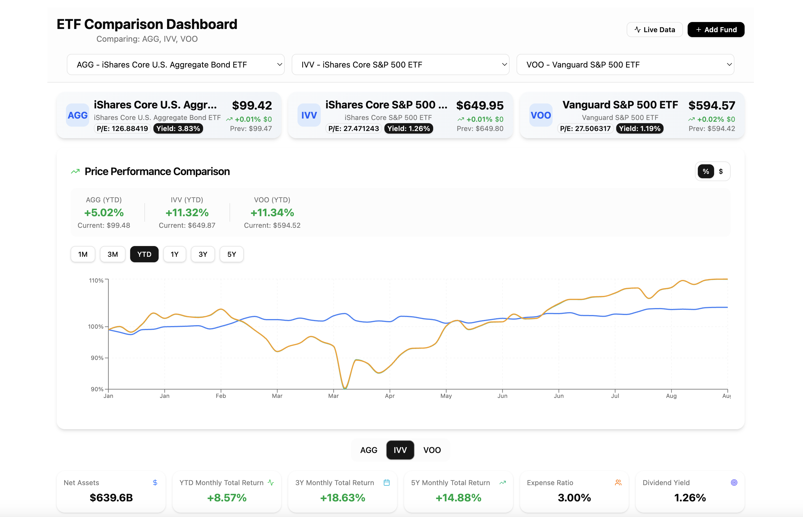

# Stock Dashboard

A comprehensive ETF (Exchange-Traded Fund) comparison and analysis platform built with a modern tech stack. This application provides real-time ETF data visualization, portfolio comparison tools, and detailed financial analytics.

## 📸 Screenshots

### Main Dashboard - ETF Comparison View


### Dashboard Analytics - Detailed Performance View  

## 🚀 Features

- **Real Daily ETF Data**: Live market data from Yahoo Finance via yfinance API
- **Interactive Comparisons**: Side-by-side comparison of up to 3 ETFs
- **Rich Visualizations**: Performance charts, holdings analysis, sector breakdowns
- **Comprehensive Analytics**: Key metrics, historical performance, technical indicators
- **Modern UI**: Responsive design with dark/light mode support
- **RESTful API**: Well-documented FastAPI backend with automatic OpenAPI docs

## 📋 Table of Contents

- [Architecture](#architecture)
- [Tech Stack](#tech-stack)
- [Quick Start](#quick-start)
- [Development Setup](#development-setup)
- [Usage](#usage)
- [API Documentation](#api-documentation)
- [Project Structure](#project-structure)
- [Data Sources](#data-sources)
- [Deployment](#deployment)
- [Contributing](#contributing)

## 🏗️ Architecture

This project follows a modern full-stack architecture with clear separation of concerns:

```
┌─────────────────┐    ┌─────────────────┐    ┌─────────────────┐
│   Frontend      │    │    Backend      │    │   Data Layer    │
│   (React/TS)    │◄──►│   (FastAPI)     │◄──►│   (SQLite)      │
└─────────────────┘    └─────────────────┘    └─────────────────┘
         │                       │                       │
         │                       │                       │
    ┌────▼────┐             ┌────▼────┐             ┌────▼────┐
    │ Vite    │             │ Uvicorn │             │ Yahoo   │
    │ Dev     │             │ ASGI    │             │ Finance │
    │ Server  │             │ Server  │             │ API     │
    └─────────┘             └─────────┘             └─────────┘
```

### Architectural Decisions

1. **Monorepo Structure**: Both frontend and backend in a single repository for simplified development and deployment
2. **SQLite for Development**: Lightweight database for rapid prototyping and easy setup
3. **FastAPI**: Modern Python web framework with automatic API documentation and type hints
4. **React + TypeScript**: Type-safe frontend development with modern React patterns
5. **Tailwind CSS + shadcn/ui**: Utility-first CSS with pre-built component library
6. **Docker Support**: Containerized deployment for consistent environments

## 🛠️ Tech Stack

### Frontend
- **React 19** - UI library with latest features
- **TypeScript** - Type safety and better developer experience
- **Vite** - Fast build tool and development server
- **Tailwind CSS** - Utility-first CSS framework
- **shadcn/ui** - Modern component library
- **Recharts** - Data visualization library
- **Lucide React** - Beautiful icon library

### Backend
- **FastAPI** - Modern Python web framework
- **SQLAlchemy** - Python SQL toolkit and ORM
- **Uvicorn** - ASGI server implementation
- **yfinance** - Yahoo Finance data API
- **Pandas** - Data manipulation and analysis
- **Pydantic** - Data validation using Python type annotations

### Database & Data
- **SQLite** - Lightweight relational database
- **Yahoo Finance** - Real-time market data source
- **80+ Popular ETFs** - Pre-configured ETF list

## ⚡ Quick Start

### Using Docker (Recommended)

1. **Clone the repository**:
   ```bash
   git clone <repository-url>
   cd StockDashboard
   ```

2. **Run with Docker**:
   ```bash
   docker build -t stock-dashboard .
   docker run -p 5173:5173 -p 8000:8000 stock-dashboard
   ```

3. **Access the application**:
   - Frontend: http://localhost:5173
   - Backend API: http://localhost:8000

### Manual Setup

1. **Clone and setup**:
   ```bash
   git clone <repository-url>
   cd StockDashboard
   ```

2. **Backend Setup**:
   ```bash
   # Create virtual environment
   python -m venv venv
   source venv/bin/activate  # On Windows: venv\Scripts\activate
   
   # Install dependencies
   pip install -r backend/requirements.txt
   
   # Initialize database with real ETF data
   cd backend
   python db/seed.py --mode real --init-db
   
   # Start backend server
   uvicorn app.main:app --reload
   ```

3. **Frontend Setup** (in a new terminal):
   ```bash
   cd frontend
   npm install
   npm run dev
   ```

4. **Access the application**:
   - Frontend: http://localhost:5173
   - Backend: http://localhost:8000

## 📖 Usage

### Basic Usage

1. **Select ETFs**: Use the dropdown menus to select up to 3 ETFs for comparison
2. **View Performance**: Analyze performance charts with different time periods (1M, 3M, YTD, 1Y, 3Y, 5Y)
3. **Compare Metrics**: Review key financial metrics, expense ratios, and performance indicators
4. **Analyze Holdings**: Explore top holdings and sector allocations
5. **Detailed Analysis**: Access comprehensive fund information and technical indicators

### Available ETFs

The system includes 80+ popular ETFs across various categories:
- **Large Cap**: SPY, VOO, VTI, IVV
- **International**: VEA, VWO, VXUS, EFA
- **Sector ETFs**: XLK (Technology), XLF (Financial), XLV (Healthcare)
- **Bonds**: BND, AGG, TLT, IEF
- **Factor ETFs**: VTV (Value), VUG (Growth), MTUM (Momentum)
- **Commodities**: GLD (Gold), SLV (Silver), DBC (Commodities)
- **Real Estate**: VNQ, VNQI

### Data Management

#### Seed with Demo Data
```bash
cd backend
python db/seed.py --mode demo --init-db
```

#### Load Real Market Data
```bash
cd backend
python db/seed.py --mode real --init-db
```

#### Full ETF Data Ingestion
```bash
cd backend
python db/ingest_yfinance.py
```

## 📚 API Documentation

### Base URL
- Development: `http://localhost:8000`
- Production: `https://your-domain.com`

### Authentication
Currently, the API is open and does not require authentication.

### Core Endpoints

#### ETF Management
- `GET /api/funds/` - List all ETFs
- `GET /api/funds/{symbol}` - Get specific ETF details
- `GET /api/funds/{symbol}/summary` - Get fund summary with top holdings and sectors
- `POST /api/funds/` - Add new ETF (requires symbol)

#### Price Data
- `GET /api/funds/{symbol}/prices/` - Get price history
- `GET /api/funds/{symbol}/prices/summary` - Get price statistics
- `GET /api/funds/{symbol}/prices/last-month` - Last 30 days
- `GET /api/funds/{symbol}/prices/last-quarter` - Last 3 months
- `GET /api/funds/{symbol}/prices/ytd` - Year to date
- `GET /api/funds/{symbol}/prices/last-year` - Last 12 months

#### Holdings & Analysis
- `GET /api/funds/{symbol}/holdings` - Get fund holdings
- `GET /api/funds/{symbol}/sectors` - Get sector allocations


## 📁 Project Structure

```
StockDashboard/
├── backend/                    # Python FastAPI backend
│   ├── api/                   # API controllers/routers
│   │   ├── fund_controller.py # ETF CRUD operations
│   │   └── price_controller.py# Price data endpoints
│   ├── app/                   # FastAPI application
│   │   └── main.py           # App entrypoint & configuration
│   ├── db/                    # Database layer
│   │   ├── models.py         # SQLAlchemy models
│   │   ├── seed.py           # Database seeding utilities
│   │   └── ingest_yfinance.py# Yahoo Finance data ingestion
│   ├── services/              # Business logic layer
│   │   ├── fund_service.py   # Fund-related operations
│   │   └── price_service.py  # Price data operations
│   ├── tests/                 # Test suite
│   └── requirements.txt       # Python dependencies
├── frontend/                  # React TypeScript frontend
│   ├── src/
│   │   ├── api/              # API client & services
│   │   ├── components/       # Reusable React components
│   │   │   ├── ui/           # shadcn/ui base components
│   │   │   ├── ETFCard.tsx   # ETF summary cards
│   │   │   ├── PerformanceChart.tsx # Main performance chart
│   │   │   └── ...           # Other specialized components
│   │   ├── pages/            # Page-level components
│   │   │   └── MainDashboard.tsx # Main dashboard page
│   │   ├── types/            # TypeScript type definitions
│   │   └── lib/              # Utility functions
│   ├── package.json          # Node.js dependencies
│   └── vite.config.ts        # Vite configuration
├── Dockerfile                # Container configuration
└── README.md                 # This file
```

## 📊 Data Sources

### Primary Data Source: Yahoo Finance
- **Real-time Quotes**: Current prices, volume, market cap
- **Historical Data**: OHLCV data with adjustments for splits/dividends
- **Fund Information**: Holdings, sector allocations, expense ratios
- **Performance Metrics**: Returns, technical indicators, risk metrics

### Data Update Strategy
- **Real-time**: Price data refreshed on page load
- **Daily**: Historical data updated via scheduled tasks (planned)
- **Weekly**: Holdings and sector data refresh (planned)

### Data Quality
- **Validation**: Input validation on all API endpoints
- **Error Handling**: Graceful degradation when data is unavailable
- **Caching**: Planned implementation for improved performance

## 🚀 Deployment

### Docker Deployment (Recommended)

1. **Build the image**:
   ```bash
   docker build -t stock-dashboard .
   ```

2. **Run the container**:
   ```bash
   docker run -p 5173:5173 -p 8000:8000 stock-dashboard
   ```

### Manual Deployment

#### Backend Deployment
```bash
# Production WSGI server
pip install gunicorn
gunicorn -w 4 -k uvicorn.workers.UvicornWorker app.main:app --bind 0.0.0.0:8000
```

#### Frontend Deployment
```bash
# Build for production
npm run build

# Serve static files (example with serve)
npx serve dist -l 5173
```

### Environment Variables

#### Backend
- `DATABASE_URL`: SQLite database path (default: `sqlite:///./stock_dashboard.db`)
- `CORS_ORIGINS`: Allowed CORS origins (default: `*`)

#### Frontend
- `VITE_API_BASE_URL`: Backend API base URL (default: `http://localhost:8000`)

## 🗺️ Roadmap

- [ ] Add user authentication and portfolios
- [ ] Implement data caching and optimization
- [ ] Add more chart types and technical indicators
- [ ] Implement alerts and notifications
- [ ] Add more asset classes (stocks, bonds, crypto)
- [ ] Advanced portfolio analytics (through llm + rag)

---

**Built with ❤️ using modern web technologies**
